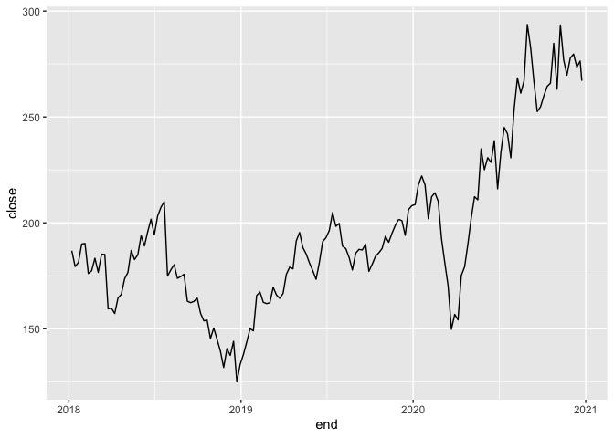

<!-- README.md is generated from README.Rmd. Please edit that file -->

# questradeR

<!-- badges: start -->

<!-- badges: end -->

An R interface to the [Questrade
API](https://www.questrade.com/api/documentation/getting-started).

## Installation

``` r
# install.packages("devtools")
devtools::install_github("colin-fraser/questradeR")
```

## Examples

### Get the time from Questrade

``` r
library(questradeR)
qt_api_time()
#> [1] "2020-12-23 17:38:38 UTC"
```

### Get my account positions

(Fake data)

``` r
qt_api_account_positions(account_id = 12345)
#> # A tibble: 2 x 13
#>   symbol symbol_id open_quantity closed_quantity current_market_… current_price
#>   <chr>      <int>         <int>           <int>            <dbl>         <dbl>
#> 1 GOOG    1234             1000               0            93392.         944
#> 2 FB      9943             1000               0            10335          1923
#> # … with 7 more variables: average_entry_price <dbl>, day_pnl <dbl>,
#> #   closed_pnl <int>, open_pnl <dbl>, total_cost <dbl>, is_real_time <lgl>,
#> #   is_under_reorg <lgl>
```

### Get historical candles

``` r
qt_api_symbols(symbol_names = "FB") %>% # this will get the symbol ID, which the candles api needs
  dplyr::pull(symbol_id) %>% 
  qt_api_candles(start_time = ymd(20180101), end_time = today(), interval = "OneWeek") %>% 
  ggplot(aes(x = end, y = close)) + 
  geom_line()
```



## Getting started

Follow the [Getting Started directions in the Questrade API
documentation](https://www.questrade.com/api/documentation/getting-started).
Then run `qt_init()` to initialize `questradeR`. This will walk you
through the process of getting and setting your API keys.

### Security

Your API keys are never stored or accessed in plain text. `questradeR`
uses the `keyring` package to store keys securely in your system’s
credential store.
